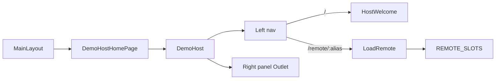

# demoHost left-nav host chrome

## Preserve plan in repo

Before implementing, write this plan into the Speckit feature folder:

[`test-host/specs/002-demo-host-nav/plan.md`](test-host/specs/002-demo-host-nav/plan.md)

Match the existing convention next to [`specs/001-react-role-scaffold/plan.md`](test-host/specs/001-react-role-scaffold/plan.md). Content should be the agreed approach below (no Cursor frontmatter required). Optional later: `spec.md` / `tasks.md` if you expand the Speckit flow.

## Approach

Build a feature-owned host layout and mount it from **`DemoHostHomePage`** (renamed from `HostHomePage`). Navigation is **URL-based** (React Router nested routes) so the right panel is bookmarkable and matches existing router usage.

**Default for remotes:** Host init defaults to `remotes: []`. The UI is driven by [`REMOTE_SLOTS`](test-host/src/core/constants/remotes.ts): empty array → only “Host”; non-empty → “Host” + one link per slot (`slot.name` as label, `slot.alias` for loading). Add remotes with `--remote` / `--remote-name` (future: `npm run add-remote`).



## Feature layout

Create [`test-host/src/features/demoHost/`](test-host/src/features/demoHost/):

| File                   | Role                                                                                                                |
| ---------------------- | ------------------------------------------------------------------------------------------------------------------- |
| `DemoHost.tsx`         | Two-pane chrome: left nav + `<Outlet />` for the right panel; `data-testid="demo-host-home-page"` on the outer root |
| `HostWelcome.tsx`      | Sample host content for the “Host” item (title + short copy; no remote load)                                        |
| `RemotePanel.tsx`      | Reads `:alias` from `useParams`, renders `<LoadRemote alias={alias} />`                                             |
| `DemoHost.module.scss` | Left rail + content area; stack vertically on narrow (~375px) viewports                                             |
| `index.ts`             | Public exports                                                                                                      |
| `DemoHost.test.tsx`    | Unit: always shows “Host”; with mocked `REMOTE_SLOTS` shows remote name link                                        |

Nav items:

- Always: `NavLink` to `/` labeled **Host**
- For each `REMOTE_SLOTS` entry: `NavLink` to `/remote/${alias}` labeled with `name`

Use existing tokens (`--color-surface`, `--color-border`, `--space-*`) — no new design system.

## Page rename + routes

1. Rename folder/files from [`pages/HostHomePage/`](test-host/src/pages/HostHomePage/) → `pages/DemoHostHomePage/`:
   - `DemoHostHomePage.tsx` — thin wrapper rendering `<DemoHost />` only (drop direct `LoadDemoRemote` / old page chrome)
   - `DemoHostHomePage.module.scss` — remove if unused after the feature owns styles
2. Update [`hostRoutes.tsx`](test-host/src/app/routes/hostRoutes.tsx):

```tsx
{
  path: '/',
  element: <MainLayout />,
  children: [{
    element: <DemoHostHomePage />, // DemoHost + Outlet
    children: [
      { index: true, element: <HostWelcome /> },
      { path: 'remote/:alias', element: <RemotePanel /> },
    ],
  }],
}
```

3. Relax [`MainLayout.module.scss`](test-host/src/layouts/MainLayout/MainLayout.module.scss) `.main`: remove `max-width: 48rem` / centering so the left-nav layout can use full width (header + theme toggle unchanged).
4. Update any remaining imports/references to `HostHomePage` (routes, tests, comments).

## Tests

- Update [`tests/integration/host.spec.ts`](test-host/tests/integration/host.spec.ts): use `demo-host-home-page`; on `/`, assert welcome (no remote fallback by default). Navigate to the remote nav link (or `/remote/demoRemote`) before asserting empty/invalid/unreachable remote fallback.
- [`compose.spec.ts`](test-host/tests/integration/compose.spec.ts): assert `demo-host-home-page`; click the remote nav item before checking embedded `demo-feature` when a remote is configured.
- Add feature unit test as above.

## Out of scope

- Clearing this clone’s existing `starter.role.json` remotes
- Broad docs/spec renames beyond code references needed for the rename to work
- `npm run add-remote` command (planned; until then use `--remote` on init/re-init)
