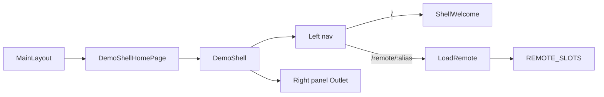

# demoShell left-nav host chrome

## Preserve plan in repo

Before implementing, write this plan into the Speckit feature folder:

[`test-shell/specs/002-demo-shell-nav/plan.md`](test-shell/specs/002-demo-shell-nav/plan.md)

Match the existing convention next to [`specs/001-react-role-scaffold/plan.md`](test-shell/specs/001-react-role-scaffold/plan.md). Content should be the agreed approach below (no Cursor frontmatter required). Optional later: `spec.md` / `tasks.md` if you expand the Speckit flow.

## Approach

Build a feature-owned shell layout and mount it from **`DemoShellHomePage`** (renamed from `ShellHomePage`). Navigation is **URL-based** (React Router nested routes) so the right panel is bookmarkable and matches existing router usage.

**Default for remotes:** Shell init defaults to `remotes: []`. The UI is driven by [`REMOTE_SLOTS`](test-shell/src/core/constants/remotes.ts): empty array → only “Shell”; non-empty → “Shell” + one link per slot (`slot.name` as label, `slot.alias` for loading). Add remotes with `--remote` / `--remote-name` (future: `npm run add-remote`).



## Feature layout

Create [`test-shell/src/features/demoShell/`](test-shell/src/features/demoShell/):

| File | Role |
|------|------|
| `DemoShell.tsx` | Two-pane chrome: left nav + `<Outlet />` for the right panel; `data-testid="demo-shell-home-page"` on the outer root |
| `ShellWelcome.tsx` | Sample host content for the “Shell” item (title + short copy; no remote load) |
| `RemotePanel.tsx` | Reads `:alias` from `useParams`, renders `<LoadRemote alias={alias} />` |
| `DemoShell.module.scss` | Left rail + content area; stack vertically on narrow (~375px) viewports |
| `index.ts` | Public exports |
| `DemoShell.test.tsx` | Unit: always shows “Shell”; with mocked `REMOTE_SLOTS` shows remote name link |

Nav items:

- Always: `NavLink` to `/` labeled **Shell**
- For each `REMOTE_SLOTS` entry: `NavLink` to `/remote/${alias}` labeled with `name`

Use existing tokens (`--color-surface`, `--color-border`, `--space-*`) — no new design system.

## Page rename + routes

1. Rename folder/files from [`pages/ShellHomePage/`](test-shell/src/pages/ShellHomePage/) → `pages/DemoShellHomePage/`:
   - `DemoShellHomePage.tsx` — thin wrapper rendering `<DemoShell />` only (drop direct `LoadDemoRemote` / old page chrome)
   - `DemoShellHomePage.module.scss` — remove if unused after the feature owns styles
2. Update [`shellRoutes.tsx`](test-shell/src/app/routes/shellRoutes.tsx):

```tsx
{
  path: '/',
  element: <MainLayout />,
  children: [{
    element: <DemoShellHomePage />, // DemoShell + Outlet
    children: [
      { index: true, element: <ShellWelcome /> },
      { path: 'remote/:alias', element: <RemotePanel /> },
    ],
  }],
}
```

3. Relax [`MainLayout.module.scss`](test-shell/src/layouts/MainLayout/MainLayout.module.scss) `.main`: remove `max-width: 48rem` / centering so the left-nav layout can use full width (header + theme toggle unchanged).
4. Update any remaining imports/references to `ShellHomePage` (routes, tests, comments).

## Tests

- Update [`tests/integration/shell.spec.ts`](test-shell/tests/integration/shell.spec.ts): use `demo-shell-home-page`; on `/`, assert welcome (no remote fallback by default). Navigate to the remote nav link (or `/remote/demoRemote`) before asserting empty/invalid/unreachable remote fallback.
- [`compose.spec.ts`](test-shell/tests/integration/compose.spec.ts): assert `demo-shell-home-page`; click the remote nav item before checking embedded `demo-feature` when a remote is configured.
- Add feature unit test as above.

## Out of scope

- Clearing this clone’s existing `starter.role.json` remotes
- Broad docs/spec renames beyond code references needed for the rename to work
- `npm run add-remote` command (planned; until then use `--remote` on init/re-init)
