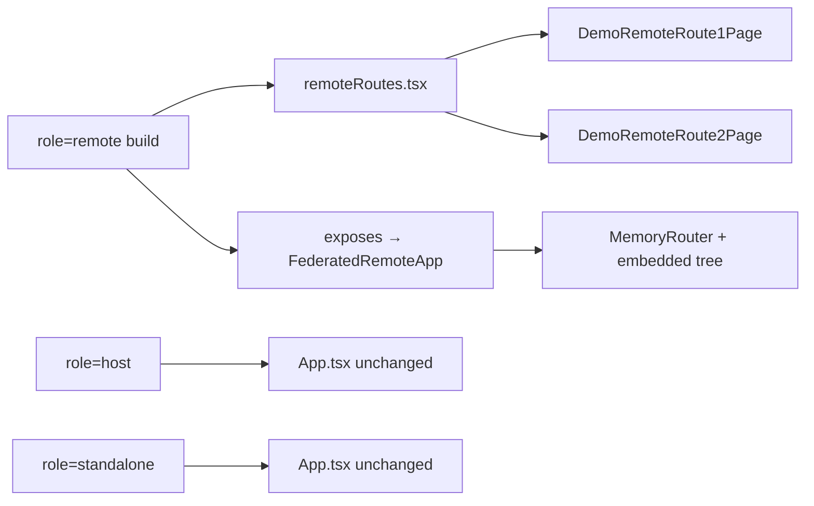

# Add demoRemote sample routes for remote role

## Hard constraint — remote only

**Do not change how the `standalone` or `host` roles work.** No edits to their route tables, chrome, bootstrap, or shared App mount path.

| Allowed | Forbidden |
|---------|-----------|
| [`remoteRoutes.tsx`](../../src/app/routes/remoteRoutes.tsx) | [`standaloneRoutes.tsx`](../../src/app/routes/standaloneRoutes.tsx), [`hostRoutes.tsx`](../../src/app/routes/hostRoutes.tsx) |
| New `features/demoRemote/`, `pages/DemoRemote*` | [`features/demo/`](../../src/features/demo/), [`features/demoHost/`](../../src/features/demoHost/), [`HomePage`](../../src/pages/HomePage/) |
| New remote-only federated entry (see below) | Changing [`App.tsx`](../../src/app/App.tsx) behavior for non-embedded mounts |
| Remote-role webpack `exposes` target | [`AppProviders`](../../src/app/providers/AppProviders.tsx), host nav / `REMOTE_SLOTS`, `LoadRemote` contract beyond what compose already does |
| Tests that target remote / compose remote panel | Changing standalone or host e2e expectations except compose’s remote-panel assertion |

## Approach

Init stays metadata-only. Sample assets live under `src/`; webpack already aliases `@active-routes` → `remoteRoutes.tsx` when `role === 'remote'`.

**No in-remote navigation:** no left navbar, link list, or route links. Labels **Route 1** / **Route 2** are page headings only. Default entry `route-1` (index redirect); `route-2` is in the route table and reachable by URL when the remote runs as its own app.

**Embedded (federated) load — remote-only entry, not App.tsx:** keep [`App.tsx`](../../src/app/App.tsx) as `useRoutes(routes)` only (host, standalone, and remote-as-own-app unchanged). For Module Federation, point the remote-role `exposes` entry at a **new** file (e.g. [`src/app/FederatedRemoteApp.tsx`](../../src/app/FederatedRemoteApp.tsx)) that:

- wraps with `MemoryRouter` (`initialEntries={['/route-1']}`)
- mounts the embedded remote route tree (no `MainLayout`)

Host still loads that expose via `LoadRemote` + `embedded={true}`; host’s own `App` / `BrowserRouter` / `hostRoutes` are untouched.

## New files

**Feature** — [`src/features/demoRemote/`](../../src/features/demoRemote/) (presentational only):

- `DemoRemoteRoute1.tsx` + scss — heading **Route 1** + short sample copy
- `DemoRemoteRoute2.tsx` + scss — heading **Route 2** + short sample copy
- `index.ts` — public exports
- Optional co-located unit smoke test

**Pages:**

- [`src/pages/DemoRemoteRoute1Page/`](../../src/pages/DemoRemoteRoute1Page/)
- [`src/pages/DemoRemoteRoute2Page/`](../../src/pages/DemoRemoteRoute2Page/)

**Federated entry:** `src/app/FederatedRemoteApp.tsx` (remote webpack expose only)

No `DemoRemote` layout, no `DemoRemoteHomePage`, no `NavLink`s.

## Wiring

**[`remoteRoutes.tsx`](../../src/app/routes/remoteRoutes.tsx)** only:

- **Remote as own app** (via unchanged `App` + `@active-routes`): `MainLayout` → index → `route-1`, plus `route-1` / `route-2`
- **Embedded tree** (exported for `FederatedRemoteApp` only): same pages, no `MainLayout`

**Webpack (remote role branch only):** `exposes[expose]` → `./src/app/FederatedRemoteApp.tsx` instead of `App.tsx`. Host/standalone webpack branches unchanged.

**Do not modify** [`App.tsx`](../../src/app/App.tsx), [`standaloneRoutes.tsx`](../../src/app/routes/standaloneRoutes.tsx), [`hostRoutes.tsx`](../../src/app/routes/hostRoutes.tsx), or demoHost.

## Tests / contract updates

- [`remote-standalone.spec.ts`](../../tests/integration/remote-standalone.spec.ts) — Route 1 content (remote role)
- [`compose.spec.ts`](../../tests/integration/compose.spec.ts) — remote panel shows demoRemote Route 1 (host chrome assertions stay as today)
- [`init-no-prune.test.mjs`](../../tests/contract/init-no-prune.test.mjs) — `demoRemote` assets survive init
- Leave [`standalone.spec.ts`](../../tests/integration/standalone.spec.ts) and host-only assertions alone unless compose’s remote panel check requires a testid swap

## Docs (light)

- [`AGENTS.md`](../../AGENTS.md) / [`README.md`](../../README.md) — remote sample is `demoRemote` multi-route; do not imply host/standalone changed

## Out of scope

- Any behavioral change to standalone or host roles
- Editing `App.tsx` for MemoryRouter / alternate trees
- Changing `init.mjs` to scaffold files
- Host nav / `REMOTE_SLOTS` / demoHost
- In-remote nav chrome or links between Route 1 and Route 2
